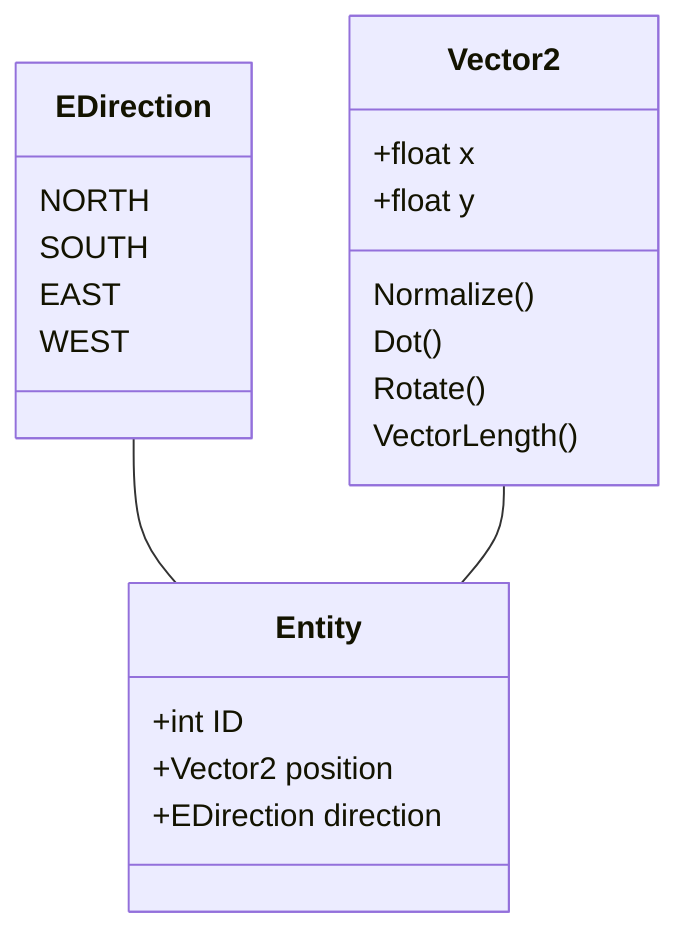

Technical Challenge for the 2023 Funded Game Development Bootcamp, Hosted by [The Developer Academy](https://thedeveloperacademy.com). 

This code is licensed under the MIT License. 

The [Google Test](https://github.com/google/googletest) library is used within this codebase for unit testing. 

## Build Instructions
### Windows
- Install CMake 3.12 or higher
- Clone the repository, and enter its directory. 
```bash
git clone https://github.com/ewanburnett/GDB-Tech-Test.git
cd GDB-Tech-Test
```
- Enter the following commands 
```bash
mkdir build
cd build
cmake ..
```
- Open the Visual Studio Solution generated by CMake, and build. 
### Linux
- Install CMake 3.12 or higher
- Clone the repository, and enter its directory. 
```bash
git clone https://github.com/ewanburnett/GDB-Tech-Test.git
cd GDB-Tech-Test
```
- Build the project using CMake
```bash
mkdir build
cd build
cmake ..
make
```

## Architecture
"Given an array of objects, each consisting of a 2D location, ID number, and cardinal direction, Write a function returning any points which intersect the visible range of a given cone."

In order for a point to be intersecting with a circle segment, 2 criteria must be met: 
1. The point must be within the radius of the circle.
2. The point must lie within the arc of the circle segment. 
Any point that meets these criteria is considered to be intersecting with the circle segment. 

This function can be broken into a number of steps:
1. Establish whether the point is within the bounds of the circle. 
2. Rotate the forwards vector $f$ by -(FoV / 2), becoming $f`$
3. Calculate the dot product between the arc start vector and the object $f` \cdot o$ 
4. If the angle $f` \cdot o$ is less than the FoV, then an intersection has occurred. 
This algorithm works for any valid Field of View, where $FoV \le x \le 360$

A number of new types are used for convenience, including a basic 2-Dimensional Vector, An Enumeration for direction definitions, and a container for each entity. 


The following pseudocode gives an overview of the algorithm used.
```c++
list<Entity> world;
//...
list<int> VisiblePoints(Entity e, float FoV, float distance){
	list<int> intersections;
	for(other : world){
		//Establish whether this entity intersects with the sphere originating from e, with radius of distance. 
		if(VectorLength2D(other.position - e.position) > radius)
			continue; //This entity is outside of the bounding sphere, so skip it. 
		//Rotate the Forwards vector by -(FoV / 2) degrees
		arcStart = Vector2::Rotate(e.direction, FoV / 2);

		//Compute the angle between the start of the FoV arc and the other entity.
		toOther = Normalize(other.position - e.position);
		fDotOther = Dot(arcStart, toOther);

		//As long as the angle to the other entity is within our range, an intersection has occurred. 
		if(fDotOther > 0.0 && fDotOther < DegToRad(FoV)){
			intersections.push(other.ID);
		}
	}

	return intersections;
}
```

### Mathematical Definitions
#### 2D Dot Product 
The Dot Product gives the angle between two vectors, in Radians. 
$$
dot_{(a, b)} = (a_x * b_x) + (a_y * b_y) = |a||b|\cos(\theta) 
$$

#### 2D Vector Length
The 2D Length of a Vector is identical to Pythagoras' Theorem. 
$$
|(x, y)| = length_{(x, y)} = \sqrt{x^2 + y^2}
$$

#### Normalization
Normalizing a Vector divides it by its length, in effect mapping it to the range $ {(0, 0)} \le {(x, y)} \le {(1, 1)} $

$$
||(x, y)|| = normalize_{(x, y)}= \frac {(x,y)}{|(x, y)|} = \frac {(x, y)}{\sqrt{(x^2+y^2)}}
$$

#### Sphere Intersection
If the distance between points a and b is less than or equal to the radius of the sphere originating at point a, then point b intersects. 
```c++
bool Intersects(Vector2 center, float radius, Vector2 point){
	Vector2 toPoint = point - center;
	if(Vector2::Length(toPoint) > radius){
		return false;    //The point lies outside of the sphere's radius. 
	}
	return true; 
}
```

### 2D Vector Rotation
2D Rotation is defined as an anticlockwise Rotation in the Z axis, using the 2x2 Z Rotation Matrix where $\theta$ is the angle to rotate. 
(note: This matrix is in Row major format.)
$$
RotZ(\theta) =
\begin{bmatrix}
	cos(\theta), sin(\theta) \\
	-sin(\theta), cos(\theta)  
 \end{bmatrix}
$$
Multiplying a vector with this matrix using matrix multiplication yields
$$
v = (x, y) \\
v \cdot RotZ(\theta) = (x cos(\theta) + y (-sin(\theta)), x sin(\theta), y cos(\theta))
$$

## Tests
All tests are run on the following dataset, found within TestData.csv

| X | Y | Number | Direction |
|-|-|-|-|
| 28| 42| 1| North|
|27|46|2|East|
|16|22|3|South|
|40|50|4|West|
|8|6|5|North|
|6|19|6|East|
|28|5|7|South|
|39|36|8|West|
|12|34|9|North|
|36|20|10|East|
|22|47|11|South|
|33|19|12|West|
|41|18|13|North|
|41|34|14|East|
|14|29|15|South|
|6|49|16|West|
|46|50|17|North|
|17|40|18|East|
|28|26|19|South|
|2|12|20|West|


